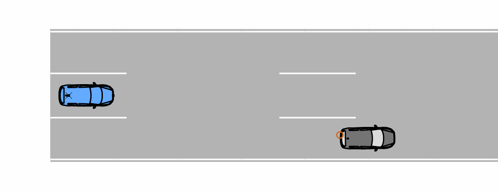
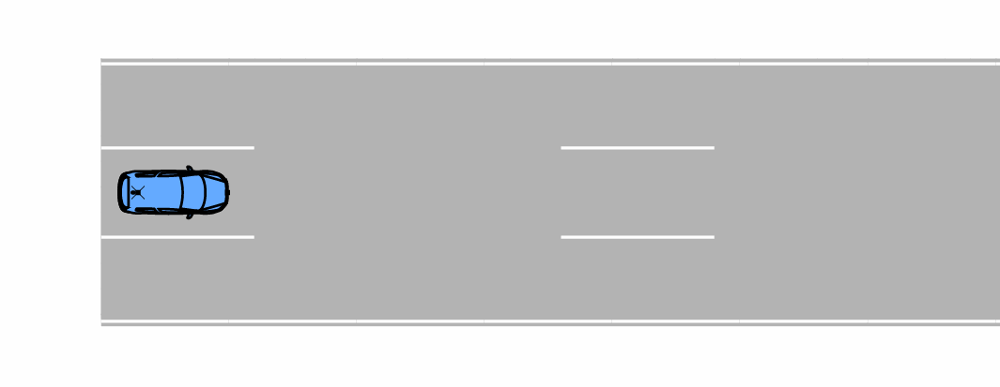

# Cut-In
With only two inputs, this scenario is well-suited for demonstration purposes. The cut-in maneuver is a quite simple scenario. However, the assessment of the scenario is non-trivial since it has longitudinal and lateral components. Since d_min and TTC_min are calculated using the longitudinal distance, the cases where the co vehicle cuts in behind the ego vehicle result in negative values for d_min and TTC_min.
## Functional Scenario
An automated vehicle (ego) is driving in the middle lane of a straight road with three lanes. Another vehicle drives ahead in the right lane and immidiately cuts into the ego's lane.
## Logical Scenario
The initial situation is the following: On a three-lane road, a vehicle (co) is driving in the right lane with a constant velocity of 80 km/h. in the middle lane, another vehicle (ego) equipped with Adaptive Cruise Control (ACC) as well as Automated Emergency Braking (AEB) is driving. Its velocity is d_v higher than that of the co vehicle. The vehicles have a time gap of d_t. Then, the vehicle in front immediately performs a lane change to the ego's lane; the ACC and AEB functions of the ego try to avoid a collision. If the co collides sideways with the ego, negative values for d_min and TTC_min can occur. Values of -10 s indicate that the ego has overtaken the co before the latter shears in.
The scenario is illustrated below:

### Inputs
|Input|Unit|Min|Max|Type|Explanation|
|-|-|-|-|-|-|
|d_v|km/h|0|120|continuous|initial relative velocity between the two vehicles|
|d_t|s|0.1|10.0|continuous|initial longitudinal timegap between the two vehicles|
### Outputs
|Output|Unit|Type|Explanation|
|-|-|-|-|
|TTC_min|s|continuous|minimal time to collision (TTC) in longitudinal direction|
|d_min|m|continuous|minimal distance in longitudinal direction|
|collision||binary|collision indicator based on rough bounding box|
## Concrete Scenarios
Both datasets contain concrete scenarios which are evenly distributed within the input space defined over the inputs. The train_validation dataset is generated based on the Sobol sequence, the test dataset is generated based on pseudo-random numbers generated by numpy.
