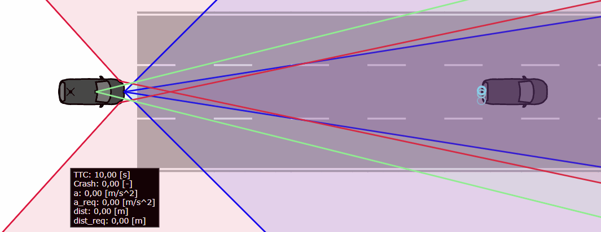
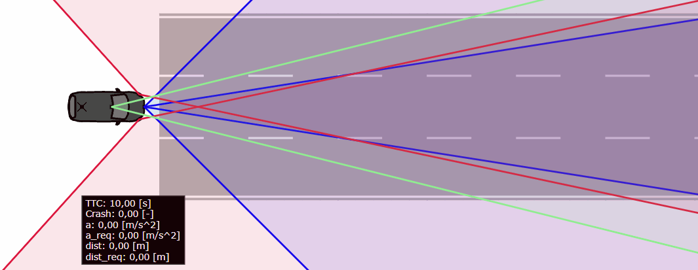

# Emergency Braking

## Functional Scenario
An automated vehicle follows another vehicle (co) on a straight road. Suddenly, the co carries out an emergency braking maneuver.
## Logical Scenario
In this scenario, both vehicles are in the same lane of a straight road. It is the task of the following vehicle (ego) to avoid a collision with the vehicle in front (co) using Adaptive Cruise Control (ACC) as well as Automated Emergency Braking (AEB) functions. Initially, the vehicle in front moves with a velocity v_co, the following vehicle moves with a speed v_ego, and there is a time gap of d_t between the vehicles. The vehicle in front immediately starts to brake with a deceleration of a_co until it reaches a speed of v_co_min_frac * v_co.
The scenario is illustrated below:

### Inputs
|Input|Unit|Min|Max|Type|Explanation|
|-|-|-|-|-|-|
|a_co|m/s^2|-1|-10|continuous|deceleration of the co|
|v_co_min_frac||0.1|1.0|continuous|final velocity of the co as a fraction of v_co|
|d_t|s|0.5|3.0|continuous|initial time gap between the co and ego|
|v_co|km/h|80|150|continuous|initial velocity of the co|
|v_ego|km/h|80|150|continuous|initial velocity of the ego|
### Outputs
|Output|Unit|Type|Explanation|
|-|-|-|-|
|TTC_min|s|continuous|minimal time to collision (TTC) in longitudinal direction|
|d_min|m|continuous|minimal distance in longitudinal direction|
|collision||binary|collision indicator based on rough bounding box|
## Concrete Scenarios
Both datasets contain concrete scenarios which are evenly distributed within the input space defined over the inputs. The train_validation dataset is generated based on the Sobol sequence, the test dataset is generated based on pseudo-random numbers generated by numpy.
