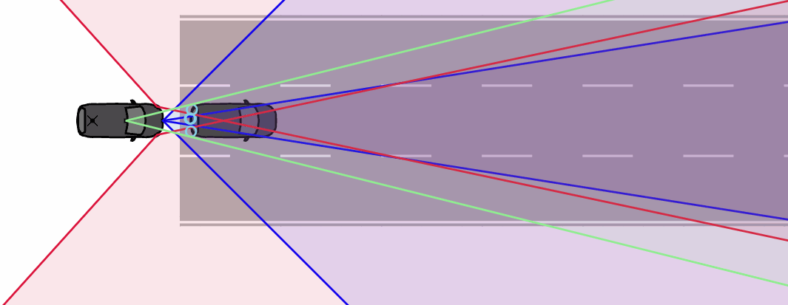
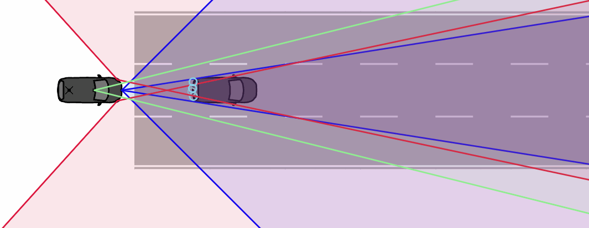

# Following

## Functional Scenario
An automated vehicle follows another vehicle, which initially accelerates, holds its velocity and then brakes.
## Logical Scenario
Both vehicles start from standstill. At an initial distance of d_0, the front vehicle accelerates with a_co_1 until it reaches a speed of v_co_max, which it holds for t_v_co_max. Then it decelerates with a_co_2 until it comes to a stop. The following vehicle should keep a small distance (e.g. to increase the traffic flow) while avoiding collisions. For the following vehicle, 8 different function and vehicle model parameters are varied.
The scenario is illustrated below:

### Inputs
|Input|Unit|Min|Max|Type|Explanation|
|-|-|-|-|-|-|
|d_0|m|1|5|continuous|initial distance between co and ego|
|a_co_1|m/s^2|0.5|4|continuous|initial acceleration of the co|
|v_co_max|km/h|5|60|continuous|maximum velocity of the co|
|t_v_co_max|s|0.0|4.0|continuous|time for which the co holds maximum velocity|
|a_co_2|m/s^2|-1|-10|continuous|deceleration of the co after holding its velocity for t_v_co_max|
|f_aEgo_max|m/s^2|1|3|continuous|maximum requested acceleration of the ego's ACC|
|f_acc_min|m/s^2|-2|-4|continuous|maximum requested deceleration of the ego's ACC|
|f_aEgo_min|m/s^2|-5|-10|continuous|maximum possible deceleration of the ego|
|f_safetyDistanceTimeGap|s|0.5|2.5|continuous|requested time gap of the ego's ACC|
|f_safetyDistanceMin|m|1|5|continuous|distance where the ego's AEB is activated|
|v_t_1|s|0.015|0.03|continuous|first time constant of the ego's longitudinal dynamic|
|v_t_2|s|0.015|0.03|continuous|second time constant of the ego's longitudinal dynamic|
|v_delay|s|0.02|0.3|continuous|delay of the ego's reaction|
### Outputs
|Output|Unit|Type|Explanation|
|-|-|-|-|
|TTC_min|s|continuous|minimal time to collision (TTC) in longitudinal direction|
|d_min|m|continuous|minimal distance in longitudinal direction|
|collision||binary|collision indicator based on rough bounding box|
## Concrete Scenarios
Both datasets contain concrete scenarios which are evenly distributed within the input space defined over the inputs. The train_validation dataset is generated based on the Sobol sequence, the test dataset is generated based on pseudo-random numbers generated by numpy.
