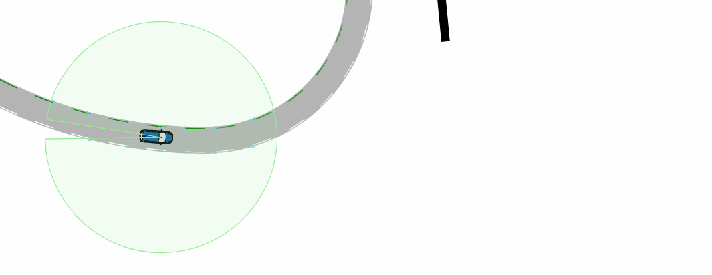
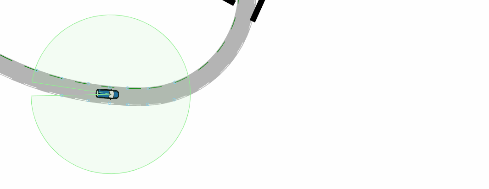

# Lane-Keeping

## Functional Scenario
An automated vehicle has to follow a curved road, where different obstacles can hide the lane markings.
## Logical Scenario
The automated vehicle starts with the pose x_ego, y_ego, theata_ego and has a velocity of v_ego. The vehicle's sensor system detects lane markings. These serve as input for the lane-keeping system. Four obstacles can obscure the view of the lane, depending on their orientation theta_obs_1, theta_obs_2, theta_obs_3, theta_obs_4. 7 different function and vehicle model parameters are varied.
The scenario is illustrated below:

### Inputs
|Input|Unit|Min|Max|Type|Explanation|
|-|-|-|-|-|-|
|x_ego|m|-38.5|-37.5|continuous|initial x coordiante of the ego|
|y_ego|m|120.5|121.5|continuous|initial y coordiante of the ego|
|theta_ego|deg|3.7|4.1|continuous|initial orientation of the ego|
|v_ego|km/h|20|40|continuous|velocity of the ego|
|theta_obs_1|deg|-120|-45|continuous|orientation of obstacle 1|
|theta_obs_2|deg|-105|25|continuous|orientation of obstacle 2|
|theta_obs_3|deg|90|110|continuous|orientation of obstacle 3|
|theta_obs_4|deg|90|110|continuous|orientation of obstacle 4|
|f_t|s|0.2|0.4|continuous|time horizon of the lane-keeping pre-controller|
|f_p||0.15|0.25|continuous|P of the lane-keeping controller|
|f_i||0.002|0.005|continuous|I of the lane-keeping controller|
|f_d||0.6|1.2|continuous|D of the lane-keeping controller|
|v_t_1|s|0.1|0.2|continuous|first time constant of the ego's lateral dynamic|
|v_t_2|s|0.005|0.015|continuous|second time constant of the ego's lateral dynamic|
|v_delay|s|0.0|0.1|continuous|delay of the ego's reaction|
### Outputs
|Output|Unit|Type|Explanation|
|-|-|-|-|
|lane_lost||binary|indicator if the ego has lost one of the lanes entirely|
|pos_lat_err_max|m|continuous|maximum error of the lateral position|
|pos_lat_err_min|m|continuous|minimum error of the lateral position|
|theta_err_max|deg|continuous|minimum error of the ego's orientation|
|theta_err_min|deg|continuous|maximum error of the ego's orientation|
|pos_lat_abs_err_max|m|continuous|maximum absolute error of the lateral position|
## Concrete Scenarios
Both datasets contain concrete scenarios which are evenly distributed within the input space defined over the inputs. The train_validation dataset is generated based on the Sobol sequence, the test dataset is generated based on pseudo-random numbers generated by numpy.
