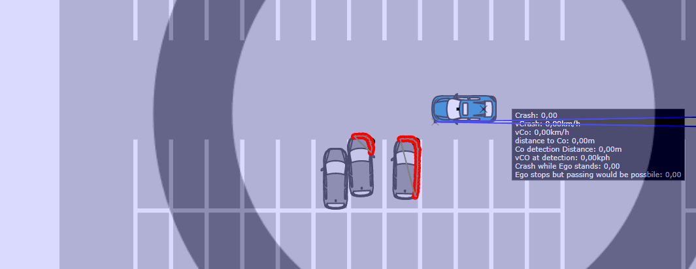
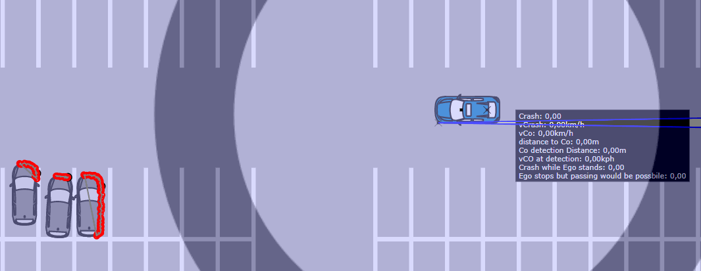

# Parking

## Functional Scenario
An automated vehicle drives across a parking lot. Two other vehicles occlude a third vehicle that suddenly leaves its parking lot.
## Logical Scenario
The automated vehicle starts on position x_ego, y_ego and has a velocity of v_ego. Two other vehicles (co_2 and co_3) occlude a third vehicle that suddenly leaves its parking lot. The third vehicle drives on a trajectory with a yaw radius of yaw_rad_co_1 and an acceleration of a_1_co_1 until it reaches v_max_co_1, which it holds for t_v_max_co_1 before it decelerates with a_2_co_1. A number of functional and dynamics parameters for the ego (the visibility threshold d_detect_min, the jerk j_ego, the maximum deceleration a_ego, the reaction time t_delay_ego) influence the ego's behavior.
The scenario is illustrated below:

### Inputs
|Input|Unit|Min|Max|Type|Explanation|
|-|-|-|-|-|-|
|v_ego|km/h|5|20|continuous|initial velocity of the ego|
|x_ego|m|5|50|continuous|initial x coordiante of the ego|
|y_ego|m|1|5|continuous|initial y coordiante of the ego|
|t_delay_ego|s|0.1|1|continuous|delay of the ego's reaction|
|a_ego|m/s^2|-9|-3|continuous|maximum deceleration of the ego|
|j_ego|m/s^3|5|20|continuous|jerk of the ego's deceleration|
|d_detect_min|m|0.1|0.8|continuous|minimum distance that the upper detected point of co 1 has to move before a braking maneuver is initiated|
|yaw_rad_co_1|m|10|70|continuous|yaw radius of co 1|
|y_offset_co_1|m|-0.5|0.5|continuous|y offset from reference parking position of co 1|
|x_offset_co_1|m|-0.4|0.4|continuous|x offset from reference parking position of co 1|
|a_1_co_1|m/s^2|0.5|3|continuous|acceleration of co 1|
|v_max_co_1|km/h|3|10|continuous|maximum velocity of co 1|
|a_2_co_1|m/s^2|-9|-3|continuous|deceleration of co 1 after holding the maximum velocity|
|t_v_max_co_1|s|0.1|2|continuous|time co 1 holds its maximum velocity|
|x_offset_co_2|m|-0.4|0.4|continuous|x offset from reference parking position of co 2|
|x_offset_co_3|m|-0.4|0.4|continuous|x offset from reference parking position of co 3|
|y_offset_co_2|m|-0.5|0.5|continuous|y offset from reference parking position of co 2|
|y_offset_co_3|m|-0.5|0.5|continuous|y offset from reference parking position of co 3|
|theta_co_2|deg|-5|5|continuous|angular offset of co 2 to reference parking position of co 2|
|theta_co_3|deg|-5|5|continuous|angular offset of co 3 to reference parking position of co 3|
### Outputs
|Output|Unit|Type|Explanation|
|-|-|-|-|
|criterion||continuous|d_min for d_min > 0, otherwise -v_ego_collision|
|d_min|m|continuous|minimum distance between ego and co 1|
|collision||binary|collision indicator based on rough bounding box|
|v_ego_collision|km/h|continuous|velocity of the ego in the moment of the collision|
|v_co_collision|km/h|continuous|velocity of the co in the moment of the collision|
## Concrete Scenarios
Both datasets contain concrete scenarios which are evenly distributed within the input space defined over the inputs. The train_validation dataset is generated based on the Sobol sequence, the test dataset is generated based on pseudo-random numbers generated by numpy.
