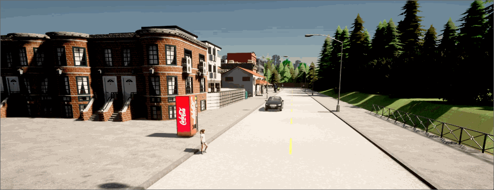
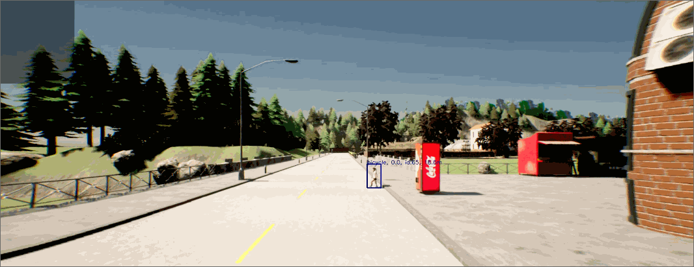
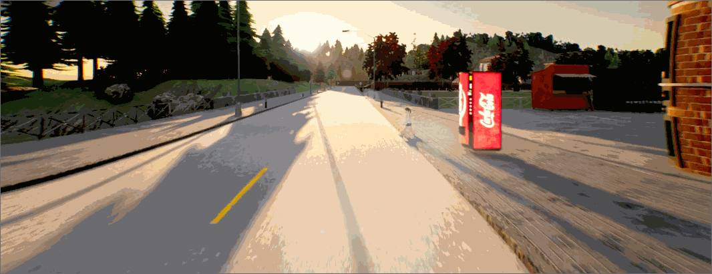

# Jaywalking
This scenario is part of an upcoming paper. A reference to the paper will be added here as soon as it is published.
## Functional Scenario
An automated vehicle (AV) drives in a suburban area. Suddenly, an initially occluded child crosses the road in front of the AV.
## Logical Scenario
The AV starts from standstill and accelerates to v_av. As soon as the AV arrives at a triggering point (at this point, it has reached its target velocity), a child is spawned at a longitudinal distance of d_0. The child is initially occluded by a vending machine and immediately starts moving towards the road with a velocity of v_ped. The environmental conditions are varied in terms of rain, fog, wind, and the time of day. The scenario implementation is based on the Scenario 3 of the [CARLA Scenario Runner](https://github.com/carla-simulator/scenario_runner). The initial lateral distance between the center of the AV and the child is 4 m as in the [Euro-NCAP scenario Car-to-Pedestrian Nearside Child](https://cdn.euroncap.com/media/26997/euro-ncap-aeb-vru-test-protocol-v20.pdf). The agent used to control the AV is [Pylot](https://github.com/erdos-project/pylot).
The scenario is illustrated below:

### Inputs
|Input|Unit|Min|Max|Type|Explanation|
|-|-|-|-|-|-|
|v_av|m/s|4.5|7.5|continuous|target velocity of the AV|
|v_ped|m/s|0.4|2.0|continuous|velocity of the child|
|d_0|m|0|50|continuous|longitudinal distance, at which the child is spawned (with reference to the front of the AV)|
|rain_rel||0|1|continuous|normalized rain intensity, also influences tire-road friction|
|fog_rel||0|1|continuous|normalized fog intensity|
|wind_rel||0|1|continuous|normalized wind intensity|
|time_of_day|h|0|24|continuous|time of day|
### Outputs
|Output|Unit|Type|Explanation|
|-|-|-|-|
|min_dist*|m|continuous|the minimal distance between the AV and child (the AV is approximated by a rectangle and the child is approximated by a circle). In case of a collision, the (negated) remaining braking distance of the AV is used, assuming that the AV decelerates as much as possible given the tire-road friction. Hence, all values below 0 indicate a collision|
|carla_collision||binary|collision indicator based on CARLA's collision detection. Since CARLA's collision detector uses polygon models, there is a small number of cases where this collision indicator does not match the sign of the min_dist* KPI|
## Concrete Scenarios
The monte_carlo dataset contains concrete scenarios that are parameterized based on various studies regarding weather conditions, pedestrians' velocities in different weather conditions, and pedestrians' traffic gap acceptance. This is explained in detail in the paper. The quasi_random dataset contains concrete scenarios which are evenly distributed within an orthotope enclosing the monte_carlo scenarios; the paramterizations are generated using the Sobol sequence.
